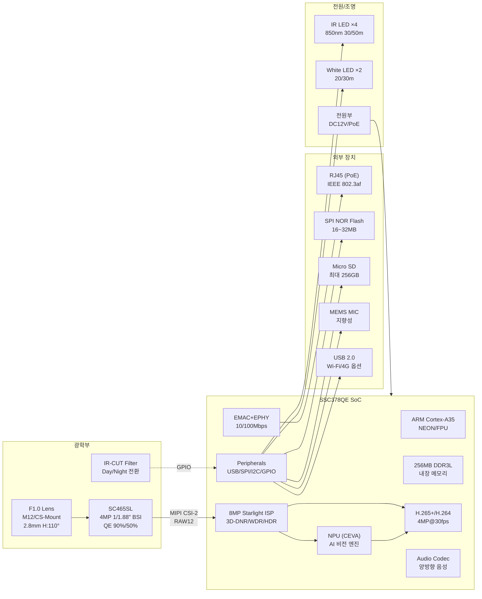
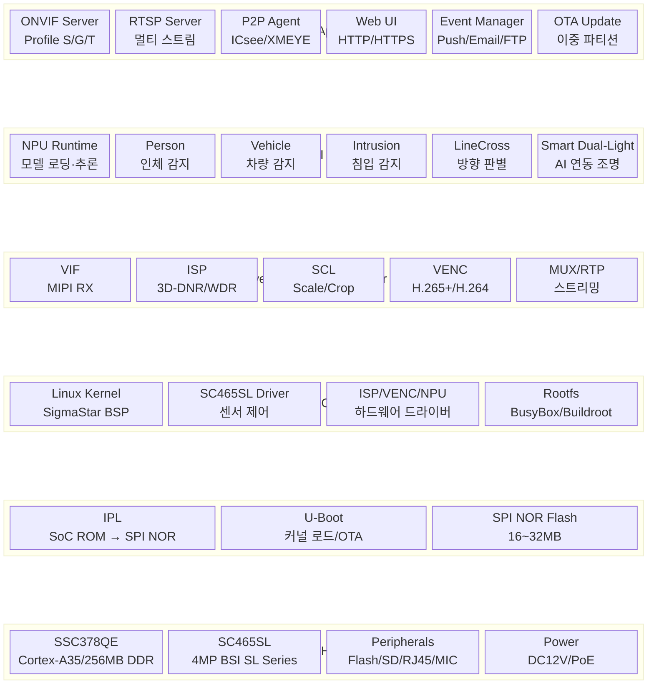

# 제품 기획서

## SC465SL + SSC378QE 기반 AI Starlight IP Camera

---

| 항목       | 내용                          |
|------------|-------------------------------|
| 문서 번호  | PD-2026-CAM-001               |
| 버전       | v1.1                          |
| 작성일     | 2026-04-23                    |
| 작성자     |                               |
| 보안 등급  | 사내 기밀 (Confidential)       |
| 상태       | 초안 (Draft)                  |

| 변경 이력 | |
|---|---|
| v1.0 → v1.1 | SoC를 SSC387QE에서 SSC378QE로 정정. 전체 스펙 및 아키텍처 재작성 |

---

## 1. Executive Summary

본 문서는 SmartSens SC465SL 이미지 센서와 SigmaStar SSC378QE AI 비전 SoC를 핵심 칩셋으로
채택한 차세대 4MP AI Starlight IP 카메라의 제품 기획서이다.

SSC378QE는 SigmaStar Infinity6c(Maruko) 시리즈의 상위 모델로, ARM Cortex-A35 CPU,
256MB DDR3(L) 내장, 8MP Starlight ISP, NPU, H.265+ 인코더를 단일 칩에 통합한 고성능
IP 카메라 SoC이다. 본래 8MP/4K까지 지원하지만, 4MP 센서인 SC465SL과 조합함으로써
ISP와 NPU의 처리 여유를 극대화하여 저조도 화질과 AI 분석 성능을 동시에 끌어올리는 전략을
취한다.

SC465SL은 SmartSens SL(Star Light) 시리즈의 최신 4MP BSI 센서로, SmartClarity®-3 공정에
기반한 SFCPixel® 기술과 Lightbox IR® NIR 강화 기술을 탑재하여, 가시광 QE ~90%, 850nm
NIR QE ~50%의 업계 최고 수준 광전변환 효율을 달성한다.

이 두 칩의 조합은 "성숙한 SoC 플랫폼의 안정성"과 "최신 SL 센서의 물리적 저조도 우위"가
만나는 최적점으로, AI 기반 지능형 보안 감시 카메라 시장에서 화질·기능·원가의 균형 잡힌
경쟁력을 목표로 한다.

---

## 2. 배경 및 시장 분석

### 2.1 시장 동향

글로벌 보안 카메라 시장은 "AI + 저조도 풀컬러"의 두 축으로 진화하고 있다. 2024년 기준
전 세계에 설치된 보안 카메라의 약 16% 이상이 AI 기술을 탑재하고 있으며, 이 비율은 2026년까지
40% 이상으로 급증할 것으로 예상된다. 동시에 "Starlight → Black Light → Ultra Starlight"로
이어지는 저조도 풀컬러 기술의 세대 교체가 가속화되고 있다.

SigmaStar는 2024년 기준 전 세계 IPC SoC 출하량의 41.2%를 차지하는 글로벌 1위 공급자이며,
SSC377/378 시리즈는 중저가 Starlight 카메라 시장의 사실상 표준 플랫폼으로 자리잡았다.
이미 검증된 SSC378QE 플랫폼 위에 최신 SL 시리즈 센서를 탑재하는 것은 개발 리스크를
최소화하면서 제품 경쟁력을 극대화하는 전략이다.

### 2.2 경쟁 구도

현재 4MP급 Starlight/Black Light 카메라 시장의 주요 SoC-센서 조합은 다음과 같다.

첫째, SSC378QE/DE + SC850SL(8MP) 또는 IMX415(8MP) — 현재 시장의 주류 8MP 조합.
둘째, SSC378QE/DE + SC4210(4MP) — 기존 4MP Starlight 카메라의 표준 조합.
셋째, Novatek NT98529 + SC850SL — 경쟁 SoC 플랫폼.
넷째, Axera AX620Q + SC850SL — AI-ISP를 내세운 신규 경쟁자.

본 제품은 두 번째 조합(SSC378QE + SC4210)의 직접적인 후속 제품으로, 센서를 SC4210에서
SC465SL(SL 시리즈)로 교체하여 저조도 화질을 한 세대 끌어올리는 것이 핵심이다.

### 2.3 기회 요인

SSC378QE + SC465SL 조합은 다음과 같은 시장 기회를 포착한다.

첫째, SC465SL의 가시광 QE 90%와 SSC378QE의 8MP Starlight ISP가 결합되면, 4MP 해상도에서
ISP 처리 여유가 충분하여 3D-DNR, WDR 등 화질 향상 알고리즘을 최대한 활용할 수 있다.

둘째, SSC378QE의 256MB 내장 DDR은 외부 메모리 없이도 4MP 영상 처리 + AI 추론을 동시
수행하기에 넉넉하며, 외장 DDR 칩이 불필요하여 BOM 비용과 PCB 복잡도를 절감할 수 있다.

셋째, SSC378QE는 이미 시장에서 수년간 검증된 성숙한 플랫폼이므로, SDK·드라이버·레퍼런스
디자인이 풍부하고, 양산 공급이 안정적이다. 개발 리스크를 최소화할 수 있다.

넷째, 4MP는 8MP 대비 데이터량이 절반이므로, 네트워크 대역폭, NVR 스토리지, 인코딩 부하
측면에서 총 시스템 비용이 낮아, 기존 인프라 교체 없이 업그레이드가 가능하다.

---

## 3. 제품 개요

### 3.1 제품명 (가칭)

**StarVision AI-4M** 시리즈

### 3.2 제품 라인업

| 모델 (가칭)       | 폼팩터         | 조명               | 방수 등급 | 주요 타겟          |
|--------------------|----------------|--------------------|-----------|---------------------|
| SV-4M-BL-T        | Turret (해바라기) | Dual-Light (IR+WL) | IP67      | 옥외 일반 보안      |
| SV-4M-BL-B        | Bullet (총알형)   | Dual-Light (IR+WL) | IP67      | 옥외 장거리 보안    |
| SV-4M-BL-D        | Dome (돔형)       | IR Only             | IK10/IP67 | 실내/반달 방지      |
| SV-4M-BL-PT       | PT (팬틸트)       | Dual-Light (IR+WL) | IP66      | 옥외 능동 감시      |

### 3.3 핵심 칩셋 구성

| 구분            | 칩셋                     | 비고                                  |
|-----------------|--------------------------|---------------------------------------|
| SoC (ISP/NPU)  | SigmaStar SSC378QE       | Infinity6c, Cortex-A35, 256MB DDR     |
| Image Sensor    | SmartSens SC465SL        | 4MP, 1/1.88", SL Series, BSI         |

### 3.4 제품 컨셉 키워드

**"검증된 플랫폼, 진화된 센서 — 별빛 아래 풀컬러"**

---

## 4. 핵심 칩셋 상세 스펙

### 4.1 SigmaStar SSC378QE — IP Camera SoC

| 항목                  | 사양                                            |
|-----------------------|-------------------------------------------------|
| 시리즈 / 코드네임     | Infinity6c (Maruko) — SSC37X 시리즈              |
| CPU                   | ARM Cortex-A35 (NEON, FPU)                       |
| 내장 메모리           | 256MB DDR3(L)                                    |
| NPU                   | 내장 (CEVA 기반 비전 AI 플랫폼)                   |
| ISP                   | 8MP Starlight ISP                                |
| ISP 최대 해상도       | 8MP (3840×2160) — 본 제품은 4MP로 운용            |
| ISP 기능              | Color Night Vision, HDR, WDR, 3D-DNR, De-fog     |
| 비디오 인코딩         | H.265+ / H.265 / H.264, 최대 4K@25fps            |
| 인코딩 기능           | 비트레이트 0.1M ~ 16Mbps, ROI 인코딩              |
| 센서 인터페이스       | MIPI CSI-2 (2/4 Lane)                             |
| 오디오                | 내장 오디오 코덱, I2S                              |
| 네트워크              | Ethernet MAC + PHY 내장 (10/100Mbps)              |
| USB                   | USB 2.0 Host/OTG (EHCI 호환)                     |
| 기타 인터페이스       | SPI, I2C, UART, GPIO, PWM, ADC                    |
| 보안                  | ARM TrustZone, PSA Certified                      |
| 영상 처리             | EIS (전자식 손떨림 보정), LDC (렌즈 왜곡 보정)    |
| 저전력                | 내장 저전력 코프로세서 (Always-On 도메인)          |
| 소비전력              | < 660mW (4K@24fps H.264 인코딩 시)                |
| 동작 온도             | -20°C ~ 70°C                                      |
| 패키지                | QFN128                                            |

### 4.2 SmartSens SC465SL — Ultra-Starlight Image Sensor

| 항목                  | 사양                                           |
|-----------------------|------------------------------------------------|
| 시리즈                | SL (Star Light) Series                          |
| 공정 플랫폼           | SmartClarity®-3 기반 BSI                        |
| 해상도                | 4MP — 2576(H) × 1456(V)                        |
| 광학 포맷             | 1/1.88" (≒ Type 1/1.8")                        |
| 픽셀 크기             | 추정 2.9~3.0μm                                  |
| 가시광 QE (520nm)     | ~90%                                            |
| 850nm NIR QE          | ~50%                                            |
| 핵심 기술             | SFCPixel®, Lightbox IR®, SmartClarity®-3        |
| HDR                   | ColGain HDR® / Staggered HDR (120dB 추정)       |
| Read Noise            | 전세대 대비 ~38% 감소 (SL 시리즈 공통)            |
| 출력 포맷             | RAW RGB (8/10/12-bit)                           |
| 출력 인터페이스       | MIPI CSI-2 / LVDS                               |
| 전원                  | AVDD 2.8V / DVDD 1.2V / DOVDD 1.8V              |
| 고온 성능             | DC 73%↓, WP 40%↓ @80°C (SmartClarity®-3)        |
| 동작 온도             | -30°C ~ 85°C (추정)                              |
| 패키지                | CSP                                             |

### 4.3 SSC378QE + SC465SL 조합의 시너지

SSC378QE의 ISP는 본래 8MP 처리용으로 설계되었으므로, 4MP인 SC465SL과 조합하면 ISP
파이프라인에 상당한 처리 여유가 생긴다. 이 여유분을 다음과 같이 활용할 수 있다.

첫째, 3D-DNR 알고리즘에 더 많은 참조 프레임과 연산 버짓을 할당하여 저조도 노이즈
제거 성능을 극대화한다.

둘째, 256MB 내장 DDR 중 4MP 영상 처리에 약 100~120MB만 사용되므로, 나머지 메모리를
NPU AI 모델 로딩과 추론 버퍼에 할당하여, 더 크고 정확한 AI 모델을 탑재할 수 있다.

셋째, 4MP@30fps 인코딩은 SSC378QE의 최대 처리 능력(4K@25fps) 대비 여유가 있어,
듀얼 스트림(메인 + 서브) 인코딩과 AI 분석을 동시에 안정적으로 수행할 수 있다.

---

## 5. 제품 목표 스펙

### 5.1 영상 성능

| 항목                  | 목표 사양                                       |
|-----------------------|------------------------------------------------|
| 최대 해상도           | 2560 × 1440 (4MP, 2K+)                         |
| 메인 스트림           | 4MP@25/30fps                                    |
| 서브 스트림           | D1 / 720P@25fps                                 |
| 세 번째 스트림        | QVGA@15fps (AI 분석 전용)                        |
| 비디오 압축           | H.265+ / H.265 / H.264 (Baseline/Main/High)     |
| 비트레이트            | 0.1Mbps ~ 8Mbps (가변/고정)                      |
| HDR                   | 센서 HDR (ColGain HDR® / Staggered) + ISP WDR    |
| 다이내믹 레인지       | 최대 120dB (HDR 모드)                             |
| 3D DNR                | ISP 하드웨어 가속 3D-DNR (시공간 노이즈 제거)     |
| De-fog                | ISP 하드웨어 안개 제거                            |
| EIS                   | 전자식 손떨림 보정 (PT 모델)                      |
| LDC                   | 렌즈 왜곡 보정 (광각 렌즈 적용 시)                |
| Day/Night             | Auto ICR (IR-CUT 자동 전환)                      |
| 최소 조도 (컬러)      | 0.001 Lux @ F1.0 (Color Night Vision)            |
| 최소 조도 (B/W)       | 0.0001 Lux @ F1.0                               |

### 5.2 렌즈 및 광학

| 항목                  | 목표 사양                                       |
|-----------------------|------------------------------------------------|
| 렌즈 마운트           | M12 (보드 렌즈) 또는 CS-Mount                    |
| 초점 거리             | 2.8mm (Turret/Dome) / 4mm (Bullet) / 2.8~12mm (PT) |
| 최대 조리개           | F1.0 (Turret/Bullet), F1.2 (Dome)               |
| 화각(FOV)             | 2.8mm 기준 H: 110° / V: 58°                     |
| 이미지 서클           | ≥ 1/1.8" (Ø 8.9mm 이상)                         |
| IR-CUT 필터           | 기계식 ICR, 자동 Day/Night 전환                  |

### 5.3 AI 기능 (On-Device NPU)

| 기능                  | 설명                                            |
|-----------------------|------------------------------------------------|
| 사람 감지             | 인체 형상 인식, 최소 32×32px                     |
| 차량 감지             | 자동차/오토바이/자전거 분류                       |
| 침입 감지             | 사용자 정의 영역 진입/이탈 알림                   |
| 라인 크로싱           | 가상 경계선 통과 감지 및 방향 판별                |
| 얼굴 검출             | 얼굴 위치/수 감지 (옵션)                          |
| ROI 인코딩            | AI 관심 영역 자동 고화질 인코딩                   |
| Smart Dual-Light      | AI 감지 연동 IR/White LED 자동 전환               |

### 5.4 네트워크 및 프로토콜

| 항목                  | 목표 사양                                       |
|-----------------------|------------------------------------------------|
| 이더넷                | RJ45, 10/100 Base-T (SoC 내장 MAC+PHY)          |
| 프로토콜              | TCP/IP, UDP, HTTP, HTTPS, DHCP, DNS, RTSP, RTP  |
| 표준                  | ONVIF Profile S/G/T                              |
| 보안                  | TLS 1.2+, HTTPS, IP 필터, 사용자 인증, TrustZone |

### 5.5 오디오

| 항목                  | 목표 사양                                       |
|-----------------------|------------------------------------------------|
| 내장 마이크           | 지향성 MEMS 마이크 1EA                           |
| 스피커 출력           | 내장 또는 Line-out (모델별 상이)                  |
| 양방향 음성           | 지원 (Full-duplex)                               |
| 오디오 압축           | G.711a / G.711u / AAC                            |

### 5.6 조명 (Dual-Light)

| 항목                  | 목표 사양                                       |
|-----------------------|------------------------------------------------|
| IR LED                | 850nm × 2~4EA, 유효 거리 30m (Turret), 50m (Bullet) |
| White LED             | Warm White × 2EA, 유효 거리 20m (Turret), 30m (Bullet) |
| 조명 모드             | IR Only / White Only / Smart Dual-Light (자동)   |
| Smart Dual-Light      | 평시 IR, 사람/차량 감지 시 White LED 자동 점등     |

SC465SL의 Lightbox IR® 기술에 의한 850nm NIR QE ~50%는 동일 IR LED 개수에서 더 먼 거리를
커버할 수 있음을 의미한다. 기존 SC4210 대비 IR 조명 거리가 15~20% 향상될 것으로 기대된다.

### 5.7 하드웨어 일반

| 항목                  | 목표 사양                                       |
|-----------------------|------------------------------------------------|
| 전원                  | DC 12V ± 10% 또는 PoE (IEEE 802.3af, Class 3)   |
| 최대 소비전력         | ≤ 8W (IR+White LED 동시 점등 시)                 |
| 대기 소비전력         | < 3W (LED 미점등, 영상 스트리밍 시)               |
| 동작 온도             | -30°C ~ 60°C                                    |
| 보호 등급             | IP67 (Turret/Bullet), IP66 (PT)                  |
| 내충격                | IK10 (Dome 모델)                                 |
| 리셋 버튼             | 하드웨어 리셋 (핀홀)                              |
| Flash                 | SPI NOR Flash 16~32MB (FW 저장)                  |
| 크기 (Turret 기준)    | Ø110mm × 105mm (목표)                            |
| 중량 (Turret 기준)    | ≤ 350g                                           |

---

## 6. 시스템 아키텍처

### 6.1 하드웨어 블록 다이어그램

> 상세 다이어그램: [hardware_diagram.html](./hardware_diagram.html)을 브라우저에서 열어 확인하세요.



#### 주요 인터페이스 연결

| 연결 | 인터페이스 | 설명 |
|------|-----------|------|
| 센서 → SoC | MIPI CSI-2 (2/4 Lane) | RAW12 비디오 데이터 |
| SoC ↔ 센서 | I2C | 센서 레지스터 제어 |
| SoC → IR-CUT | GPIO | Day/Night 전환 제어 |
| SoC → LED | GPIO PWM | IR/White LED 밝기 제어 |
| SoC ↔ Flash | SPI | 부트/펌웨어 저장 |
| SoC ↔ SD | SDIO | 로컬 녹화 |
| SoC → RJ45 | 내장 MAC+PHY | 10/100 Ethernet |


### 6.2 소프트웨어 스택

> 상세 다이어그램: [software_diagram.html](./software_diagram.html)을 브라우저에서 열어 확인하세요.



#### 비디오 파이프라인 (메인 스트림)

```
VIF (MIPI RX) → ISP (3D-DNR/WDR/CNV) → SCL (Scale/Crop) → VENC (H.265+) → RTP → RTSP
                      ↓                       ↓
                  AI Channel              SD Recording
                  (QVGA@15fps)            (MP4 Mux)
```

#### 소프트웨어 스택 레이어 설명

| Layer | 이름 | 주요 구성 요소 |
|-------|------|---------------|
| **5** | Application | ONVIF Server, RTSP Server, P2P Agent, Web UI, Event Manager, OTA |
| **4** | AI/Analytics | NPU Runtime, 사람/차량/침입/라인크로싱 감지, Smart Dual-Light |
| **3** | Media (MI) | VIF → ISP → SCL → VENC → MUX/RTP, Audio, SD Recording, JPEG Capture |
| **2** | OS/BSP | Linux Kernel, 센서 드라이버, ISP/VENC/NPU 드라이버, Rootfs |
| **1** | Boot | IPL, U-Boot, SPI NOR Flash 파티션 |
| **0** | Hardware | SSC378QE SoC, SC465SL 센서, 주변 장치, 전원 |


---

## 7. 핵심 기술 차별화

### 7.1 SL 시리즈 센서의 물리적 저조도 우위

SC465SL은 SmartSens의 최신 SmartClarity®-3 공정과 SFCPixel® 기술을 적용하여, 이전 세대
SC4210 대비 다음과 같은 근본적인 성능 향상을 달성한다.

가시광(520nm) QE ~90%는 같은 조도에서 약 20~30% 더 많은 광전류를 생성한다는 의미이다.
이는 ISP의 소프트웨어 처리만으로는 대체 불가능한 하드웨어적 이점이며, SNR(신호대잡음비)의
근본적 개선으로 직결된다. Read Noise 역시 SL 시리즈 공통으로 ~38% 감소하여, 같은 노출
시간에서 더 깨끗한 영상을 얻을 수 있다.

또한 850nm NIR QE ~50%는 IR 보조 조명 효율을 높여, 동일 IR LED 구성에서 15~20% 더
먼 거리까지 커버하거나, 같은 거리에서 LED 수를 줄여 원가를 절감할 수 있다.

### 7.2 8MP ISP로 4MP를 처리하는 여유의 활용

SSC378QE의 ISP는 8MP(3840×2160) 처리를 위해 설계되었다. SC465SL의 4MP(2576×1456)를
처리할 때 약 절반의 ISP 대역폭만 사용하므로, 나머지 리소스를 다음과 같이 활용한다.

첫째, 3D-DNR 알고리즘의 시간축 참조 프레임 수를 늘려 저조도 노이즈 제거 품질을 극대화한다.
둘째, WDR/HDR 합성 처리에 더 정밀한 톤매핑을 적용하여, 역광 환경에서의 디테일을 향상시킨다.
셋째, De-fog 알고리즘을 상시 활성화하여, 안개/미세먼지 환경에서도 선명한 영상을 제공한다.

### 7.3 256MB 내장 DDR의 메모리 전략

4MP@30fps H.265 인코딩 + 서브 스트림 + AI 추론에 필요한 메모리는 약 100~130MB로
추정된다. SSC378QE의 256MB 내장 DDR은 이를 충분히 수용하며, 약 120~150MB의
잔여 메모리는 다음과 같이 활용한다.

SD 카드 로컬 녹화를 위한 링버퍼, NPU의 대형 AI 모델(예: YOLOv5-lite 등) 로딩,
ONVIF 이벤트 큐와 메타데이터 버퍼, 그리고 향후 기능 확장(OTA 업데이트 이중 버퍼 등)을
위한 예비 메모리로 확보한다. 외장 DDR 칩이 불필요하므로 BOM 비용과 PCB 면적이 절감된다.

### 7.4 Smart Dual-Light — AI 연동 조명

NPU의 사람/차량 감지 결과를 실시간으로 조명 제어에 연동한다. 평상시에는 IR LED만
점등하여 은밀 감시를 수행하고, 사람 또는 차량이 감지되면 White LED를 자동 점등하여
풀컬러 영상 확보와 시각적 억제 효과를 동시에 제공한다. SC465SL의 높은 가시광 QE 덕분에
White LED 점등 전에도 상당 수준의 컬러 정보를 유지할 수 있어, LED 점등 빈도를 최소화하고
전력 소모와 주민 민원을 줄인다.

### 7.5 고온 안정성

SC465SL의 SmartClarity®-3 공정은 80°C에서 다크커런트(DC) 73% 감소, 화이트픽셀(WP)
40% 감소를 달성한다. 옥외 설치 카메라의 하우징 내부 온도가 여름 직사광선 아래에서
60~80°C에 달할 수 있는데, 이 환경에서도 SC465SL은 핫픽셀과 노이즈 증가를 최소화하여
안정적인 화질을 유지한다. 기존 SC4210 대비 옥외 내구성에서 세대 차이를 보인다.

### 7.6 성숙한 SoC 플랫폼의 이점

SSC378QE는 시장에서 수년간 검증된 안정적인 플랫폼이다. SDK, U-Boot, Linux BSP가
성숙하고, 다양한 센서 드라이버 레퍼런스(IMX415, SC850SL, SC4210 등)가 존재하여 SC465SL
드라이버 개발 시 참고할 수 있다. OpenIPC 커뮤니티에서도 SSC378DE 지원이 진행 중이어서,
오픈소스 리소스도 활용 가능하다. 양산 공급 안정성과 가격 경쟁력이 검증되어 있다.

---

## 8. 하드웨어 설계 요점

### 8.1 센서-SoC MIPI 인터페이스

SC465SL은 MIPI CSI-2 출력을 지원하며, SSC378QE의 MIPI CSI-2 수신부와 연결한다.
4MP@30fps 12-bit RAW 기준 2-Lane MIPI 구성으로 충분한 대역폭을 확보할 수 있다.
HDR 다중 노출 모드(60fps 이상) 사용 시에는 4-Lane 구성을 적용한다.

MIPI 배선 설계 시 차동 임피던스 100Ω 매칭, 레인 간 스큐 ±0.1mm 이내, AC 커플링 캐패시터
100nF 배치가 필수이다. ESD 보호를 위한 TVS 다이오드 추가를 권장하며, GND 비아를 충분히
배치하여 리턴 패스를 확보한다.

### 8.2 센서 제어 (I2C)

SSC378QE가 I2C 마스터로 SC465SL의 레지스터를 제어한다. 풀업 저항 2.2kΩ~4.7kΩ을
DOVDD(1.8V)에 연결한다. RESET 및 PWDN 핀은 SSC378QE GPIO에 연결하여 소프트웨어
제어를 가능하게 한다. MCLK(마스터 클럭)은 SSC378QE에서 SC465SL로 공급하며,
시리즈 저항(22~33Ω)을 삽입하여 링잉을 억제한다.

### 8.3 전원 설계

전원은 크게 SoC 전원 도메인과 센서 전원 도메인으로 구분한다.

SoC(SSC378QE) 전원은 코어(1.0V, DC-DC 사용), 내장 DDR(1.35V DDR3L 또는 1.5V DDR3),
I/O(1.8V/3.3V)로 구성된다. 내장 DDR이므로 외부 DDR 전원 레이아웃은 불필요하나, SoC
데이터시트에 명시된 DDR 전원 필터링 캐패시터 배치는 필수이다.

센서(SC465SL) 전원은 AVDD(2.8V, 저노이즈 LDO 필수), DVDD(1.2V), DOVDD(1.8V)의
세 레일로 구성한다. AVDD는 아날로그 전원이므로 PSRR이 높은 LDO를 선정하고, 센서 핀
근접에 0402 디커플링 캡을 배치한다.

전원 시퀀싱은 SigmaStar 하드웨어 디자인 가이드의 권장 순서를 엄격히 따른다.

### 8.4 PCB 설계

SSC378QE의 256MB DDR이 SoC에 내장되어 있으므로, 외부 DDR 인터페이스 배선이 불필요하다.
이는 PCB 설계를 크게 단순화하며, 4-Layer PCB로도 충분한 시그널 인티그리티를 확보할 수 있다.

레이어 스택업 권장: TOP(Signal) → GND → Power → BOTTOM(Signal).

MIPI 차동 배선과 Ethernet 트레이스는 임피던스 제어가 필요하므로, PCB 제조사와 스택업
임피던스 시뮬레이션을 사전 협의한다.

### 8.5 렌즈

1/1.88" 센서에 맞는 이미지 서클 Ø8.9mm 이상의 렌즈를 선정한다. Starlight 카메라의
핵심은 렌즈 F값이며, F1.0을 기본으로 한다(F2.0 대비 4배 집광). 초점 거리는 Turret/Dome
모델 2.8mm(광각 H:110°), Bullet 모델 4mm, PT 모델 2.8~12mm(전동 줌) 구성이다.

### 8.6 열 설계

SSC378QE는 4K 인코딩 시 660mW 수준이나, 본 제품은 4MP 운용이므로 발열이 더 낮다.
다만 옥외 하우징 내부 축열을 고려하여, QFN128 패드의 써멀 비아(최소 9~16개)와
PCB 내층 GND 플레인 열확산 설계를 적용한다. 필요 시 소형 알루미늄 방열판을 추가한다.

---

## 9. 소프트웨어 개발 계획

### 9.1 SDK 및 개발 환경

SigmaStar 공식 SDK(Infinity6c/SSC378 시리즈용)를 NDA 체결 후 확보한다. SSC378QE용
SDK는 이미 성숙한 상태이며, 다수의 센서 드라이버 레퍼런스가 포함되어 있을 것이다.
개발 호스트는 Ubuntu 20.04/22.04 기반이며, ARM 크로스 컴파일 툴체인(aarch64/arm-linux)을
사용한다.

### 9.2 센서 드라이버 개발

SC465SL은 신규 SL 시리즈 센서이므로, SDK에 기본 드라이버가 포함되어 있지 않을 가능성이
높다. SmartSens FAE로부터 레지스터 맵, 초기화 시퀀스, AE/AGC 제어 사양을 확보하여
SigmaStar MI(Media Interface) 프레임워크에 맞는 드라이버를 개발한다.

기존 SDK 내 SC4210 또는 SC485SL 드라이버를 베이스로 활용하면 개발 기간을 단축할 수 있다.
SC465SL은 SC485SL과 같은 SL 시리즈이므로 레지스터 구조가 유사할 가능성이 높다.

주요 구현 항목: 해상도/FPS별 레지스터 테이블, AE 게인/셔터 제어, ColGain HDR® 모드 설정,
MIPI 출력 구성(Lane 수, 데이터 레이트), Day/Night 전환 시 센서 모드 변경.

### 9.3 ISP IQ 튜닝

SSC378QE의 8MP Starlight ISP를 SC465SL에 최적화하는 IQ 튜닝이 개발 기간의 상당 부분을
차지할 것이다. SigmaStar IQ 튜닝 툴을 사용하여 다음 항목을 조정한다.

3D-DNR(시공간 노이즈 제거) 강도 — 저조도에서 핵심. WDR/HDR 합성 톤매핑 — SC465SL
ColGain HDR® 출력에 최적화. AWB(자동 화이트밸런스) — 다양한 광원(텅스텐, 형광등, LED,
달빛 등)에서의 색온도 보정. AE(자동 노출) — 저조도에서의 셔터/게인 전략, 플리커 방지.
CCM(색보정 행렬) — SC465SL 고유 스펙트럼 응답 보정. Sharpness/NR 밸런스 — 노이즈 제거와
디테일 보존의 트레이드오프. IR-CUT 전환 임계값 — Day↔Night 전환 lux 레벨 설정.

다양한 조도(0.001~100,000 Lux), 색온도(2000K~7500K), 온도(-30°C~60°C) 조건에서 테스트한다.

### 9.4 NPU AI 모델

SigmaStar NPU 툴체인으로 ONNX/Caffe 모델을 SSC378QE NPU 포맷으로 변환한다.
256MB 메모리 여유를 활용하여 경량 모델보다 다소 큰 모델(예: YOLOv5-lite, MobileNet-SSD
등)도 탑재 가능하다. 사람/차량 감지 모델은 SigmaStar 또는 서드파티 알고리즘 업체의
사전 최적화 모델을 활용하되, 자체 데이터셋으로 파인튜닝하여 타겟 환경의 정확도를 확보한다.

### 9.5 애플리케이션 소프트웨어

ONVIF Profile S/G/T 준수 서버, RTSP 스트리밍 서버, Web UI(설정/라이브뷰),
P2P 에이전트(ICsee/XMEYE 등), SD 카드 로컬 녹화(H.265 MP4),
이벤트 알림(HTTP Webhook/FTP/Email/Push Notification),
양방향 음성(G.711/AAC), OTA 펌웨어 업데이트 기능을 구현한다.

---

## 10. 개발 일정

| 단계 | 기간 | 주요 마일스톤 |
|---|---|---|
| **Phase 0: 킥오프** | 2026 Q2 (4주) | NDA 체결, SDK 확보, SSC378QE EVB 입수, SC465SL 샘플 확보, 팀 구성 |
| **Phase 1: 설계** | 2026 Q2~Q3 (8주) | 회로도 설계, PCB 레이아웃(4-Layer), BOM 확정, F1.0 렌즈 선정/발주 |
| **Phase 2: 시제품** | 2026 Q3 (4주) | PCB 제작, SMT, 1차 시제품(EVT) 조립 |
| **Phase 3: 브링업** | 2026 Q3 (4주) | 전원 시퀀스 검증, Linux 부팅, SC465SL MIPI 링크 확인, 기본 RAW 출력 |
| **Phase 4: SW 개발** | 2026 Q3~Q4 (10주) | 센서 드라이버 완성, ISP IQ 튜닝 (1차), AI 모델 탑재, 응용 SW 개발 |
| **Phase 5: DVT** | 2026 Q4 (4주) | 2차 시제품, 하우징 결합, 기능 검증, 환경 시험 (온도/습도) |
| **Phase 6: 최적화** | 2026 Q4~2027 Q1 (6주) | IQ 미세 튜닝 (다양한 현장), AI 정확도 최적화, 저전력/열 검증 |
| **Phase 7: 인증/양산** | 2027 Q1 (6주) | EMC(KN) / 안전(KC) / IP67 방수 인증, 양산 파일럿 런 |
| **양산 시작 (SOP)** | 2027 Q2 | 초도 생산, 출하 |

총 개발 기간: 약 10~12개월 (킥오프 → 양산)

### 10.1 크리티컬 패스 (Critical Path)

킥오프 → SC465SL 드라이버 개발 → ISP IQ 튜닝 → 양산 검증이 크리티컬 패스이다.
SC465SL 드라이버와 IQ 튜닝은 센서 데이터시트 및 SmartSens FAE 지원에 의존하므로,
Phase 0에서 SmartSens 채널을 조기 확보하는 것이 일정 준수의 핵심이다.

SSC378QE SDK와 하드웨어 레퍼런스는 성숙한 상태이므로, SoC 측 리스크는 상대적으로 낮다.

---

## 11. 원가 구조 (추정)

Turret 모델(SV-4M-BL-T) 기준 BOM 추정이다.
실제 가격은 수량, 환율, 공급 상황에 따라 변동된다.

| 구분                  | 부품                          | 추정 단가 (USD) |
|-----------------------|-------------------------------|-----------------|
| SoC                   | SSC378QE (256MB DDR 내장)     | $5.0 ~ $7.0     |
| Image Sensor          | SC465SL (4MP, SL Series)      | $3.5 ~ $5.0     |
| Flash                 | SPI NOR Flash 16MB            | $0.3 ~ $0.5     |
| Ethernet              | 내장형 RJ45 (트랜스포머 내장) | $0.3 ~ $0.5     |
| 렌즈 (F1.0, M12)     | 1/1.8" 2.8mm                  | $2.0 ~ $4.0     |
| IR-CUT                | 듀얼 필터 모듈                 | $0.5 ~ $0.8     |
| LED (IR + White)      | 850nm ×4 + Warm White ×2      | $0.5 ~ $1.0     |
| PCB (4-Layer)         | FR4, 38mm × 38mm (임피던스 제어) | $0.5 ~ $0.8  |
| MEMS 마이크           | 지향성 MEMS ×1                 | $0.2 ~ $0.3     |
| 기구/하우징           | 알루미늄 + 폴리카보네이트 Turret | $1.5 ~ $3.0   |
| PoE 모듈              | IEEE 802.3af PD 모듈           | $0.8 ~ $1.2     |
| 기타 (수동소자 등)    | LDO, DC-DC, Caps, Res, TVS 등 | $0.8 ~ $1.5     |
| **합계 (BOM)**        |                               | **$15.9 ~ $25.6** |

참고: SSC378QE는 SSC387 시리즈(64MB) 대비 DDR 용량이 크므로 SoC 단가가 다소 높으나,
외장 DDR 칩이 불필요하여 총 BOM에서는 경쟁력을 확보한다.

---

## 12. 경쟁 제품 대비 포지셔닝

| 항목 | 본 제품 (SSC378QE + SC465SL) | SSC378QE + SC4210 (기존) | SSC378DE + IMX415 (8MP) | SSC387 + SC465SL (차세대) |
|---|---|---|---|---|
| 해상도 | 4MP (2K+) | 4MP (2K+) | 8MP (4K) | 4MP (2K+) |
| 센서 세대 | SL 시리즈 (최신) | SmartClarity 1세대 | Sony STARVIS | SL 시리즈 (최신) |
| 가시광 QE | ~90% | 미공개 (낮음) | ~80% (추정) | ~90% |
| ISP | 8MP Starlight ISP | 8MP Starlight ISP | 8MP Starlight ISP | AI-ISP 6.0 |
| NPU | 有 (CEVA 기반) | 有 (CEVA 기반) | 有 (CEVA 기반) | 1.5 TOPS |
| 내장 DDR | 256MB | 256MB | 128MB (DE) | 64MB |
| 최소 조도 (컬러) | 0.001 Lux | 0.01 Lux | 0.005 Lux | 0.0002 Lux |
| BOM 비용 | ●●●●○ | ●●●●● | ●●●○○ | ●●●●○ |
| SDK 성숙도 | ●●●●● | ●●●●● | ●●●●● | ●●○○○ |
| 저조도 화질 | ●●●●● | ●●●○○ | ●●●○○ | ●●●●● |
| 고온 안정성 | ●●●●● | ●●○○○ | ●●●○○ | ●●●●● |
| 개발 리스크 | ●●●●○ (낮음) | ●●●●● (매우 낮음) | ●●●●○ (낮음) | ●●○○○ (높음) |

본 제품은 "검증된 SSC378QE 플랫폼 + 최신 SL 센서"라는 조합으로, 개발 리스크를 낮추면서도
저조도 화질에서 세대 차이의 도약을 달성하는 것이 핵심 전략이다. 향후 SSC387 시리즈 SDK가
성숙하면 AI-ISP 6.0으로 업그레이드하는 2세대 제품도 계획할 수 있다.

---

## 13. 리스크 분석 및 대응

| 리스크 | 영향도 | 발생 확률 | 대응 방안 |
|---|---|---|---|
| SC465SL 공급 불안정 (신규 센서) | 높음 | 중간 | SmartSens 조기 공급 계약 체결. 하드웨어 호환 대체 센서로 SC485SL(동일 SL 시리즈, 4MP) 확보. PCB 풋프린트 호환 설계 |
| SC465SL 센서 드라이버 부재 | 중간 | 높음 | SmartSens FAE로부터 레지스터 맵 조기 확보. SC485SL 드라이버를 베이스코드로 활용. Phase 0에서 드라이버 개발 착수 |
| ISP IQ 튜닝 장기화 | 중간 | 높음 | SigmaStar IQ 튜닝 전문 업체 외주 검토. SC4210 기존 IQ 파라미터를 초기값으로 활용 후 점진적 최적화 |
| SSC378QE 가격 인상 / 공급 이슈 | 중간 | 낮음 | 대리점 2곳 이상 확보. SSC378DE(128MB)로의 다운그레이드 옵션 사전 검토 (4MP에는 128MB도 가능) |
| F1.0 렌즈 품질 편차 | 낮음 | 중간 | 검증된 렌즈 공급사 2곳 이상 확보. MTF/해상력 수입검사 기준 수립 |
| EMC 인증 이슈 | 낮음 | 낮음 | 내장 PHY/DDR로 방사 노이즈원 최소화. 초기 설계 시 EMC 가이드라인(필터, 써멀 비아, GND 플레인) 반영 |
| SC465SL EOL 리스크 (너무 신규) | 낮음 | 낮음 | SL 시리즈는 SmartSens의 전략 라인업이므로 장기 공급 가능성 높음. SC485SL/SC489SL 호환 설계로 대비 |

---

## 14. 인력 및 자원 계획

| 역할 | 인원 | 주요 업무 |
|---|---|---|
| PM (프로젝트 매니저) | 1명 | 일정/리소스/리스크 관리, SigmaStar/SmartSens FAE 커뮤니케이션 |
| HW 설계 엔지니어 | 1~2명 | 회로도, PCB 설계, 전원, MIPI/Ethernet 시그널 인티그리티 |
| FW/BSP 엔지니어 | 1~2명 | SDK 포팅, 센서 드라이버 개발, 부팅/시스템 안정화 |
| ISP/IQ 튜닝 엔지니어 | 1명 | SC465SL + SSC378QE ISP 파라미터 최적화, 다양한 환경 화질 검증 |
| AI/응용 SW 엔지니어 | 1명 | NPU 모델 변환/배포, ONVIF/RTSP/P2P 응용 SW, Web UI |
| 기구/광학 엔지니어 | 1명 | 하우징 설계, F1.0 렌즈 선정/평가, 열 설계, 방수 구조 |
| QA/인증 엔지니어 | 1명 | 기능/환경 시험, EMC(KN)/안전(KC)/IP67 인증, 양산 품질 관리 |
| **합계** | **7~9명** | |

---

## 15. 예상 목표 시장 및 판매 계획

### 15.1 타겟 시장

주요 타겟은 한국 국내 보안 시장(아파트 단지, 상가, 공장, 물류센터, 공공기관)과
해외 ODM/OEM 시장(동남아, 중동, 유럽)이다. 4MP AI Starlight 카메라는 기존 2MP Starlight
카메라의 교체 수요와, 8MP 카메라 대비 가격 경쟁력 있는 업그레이드 옵션으로 포지셔닝한다.

### 15.2 판매 목표

| 기간 | 목표 수량 | 비고 |
|---|---|---|
| 2027 H2 (출시 후 6개월) | 5,000대 | 초기 시장 진입, 레퍼런스 프로젝트 구축 |
| 2028 전체 | 30,000대 | 국내 채널 확대, 해외 ODM 1~2건 수주 |
| 2029 전체 | 80,000대 | 해외 시장 본격 확장, 라인업 확대 |

### 15.3 목표 소비자 가격대

| 모델 | 목표 출고가 (USD) | 비고 |
|---|---|---|
| Turret (SV-4M-BL-T) | $35 ~ $50 | 주력 모델, 최대 물량 |
| Bullet (SV-4M-BL-B) | $40 ~ $55 | 장거리 옥외 수요 |
| Dome (SV-4M-BL-D) | $35 ~ $50 | 실내/반달 수요 |
| PT (SV-4M-BL-PT) | $65 ~ $90 | 능동 감시, 고부가 |

---

## 16. 향후 확장 로드맵

| 세대 | 시기 | 주요 업그레이드 | 비고 |
|---|---|---|---|
| **1세대 (본 제품)** | 2027 Q2 | SSC378QE + SC465SL | 시장 진입, 레퍼런스 확보 |
| **1.5세대** | 2027 Q4 | + Wi-Fi/4G 옵션, 태양광 배터리 모델 | 무선 시장 확장 |
| **2세대** | 2028 H1 | SSC387 + SC465SL (AI-ISP 6.0) | SoC 세대 업그레이드, 0.0002Lux |
| **2.5세대** | 2028 H2 | + SC489SL (Lightbox IR®-2) | 센서 업그레이드, NIR 45%↑ |

SSC378QE 기반으로 시장을 먼저 확보한 뒤, SSC387 시리즈 SDK가 성숙하면 AI-ISP 6.0을
탑재한 2세대로 자연스럽게 진화하는 투 스텝 전략을 취한다. 하드웨어는 센서부와 SoC부를
모듈화 설계하여, 세대 전환 시 보드 재설계를 최소화한다.

---

## 17. 결론 및 다음 단계

SSC378QE + SC465SL 조합은 "검증된 SoC 플랫폼의 안정성"과 "최신 SL 센서의 물리적 저조도
우위"가 만나는 최적점이다. 개발 리스크가 낮으면서도, SC465SL의 가시광 QE 90% / NIR QE 50%
/ SmartClarity®-3 고온 성능이라는 하드웨어적 진보를 통해, 기존 SC4210 기반 제품 대비
명확한 화질 차별화를 달성할 수 있다.

SSC378QE의 256MB 내장 DDR과 8MP급 ISP/NPU 리소스를 4MP 센서에 집중 투입하는 전략은,
"해상도 경쟁" 대신 "화질 경쟁"에서 승부하겠다는 제품 철학을 반영한다. 실제 보안 현장에서는
4K 해상도보다 야간 컬러 화질과 AI 감지 정확도가 훨씬 더 중요하다.

본 기획이 승인되면 다음 단계로 즉시 진행한다.

1. SigmaStar NDA 체결 → SSC378QE SDK 및 EVB 확보
2. SmartSens NDA 체결 → SC465SL 데이터시트, 레지스터 맵, 샘플 확보
3. EVB 상에서 SC465SL 센서 드라이버 사전 개발 착수
4. F1.0 렌즈 후보 3종 선정 및 평가 샘플 발주
5. 상세 회로도 설계 착수 (Phase 1)

---

*본 문서는 초안이며, 칩 벤더의 최종 데이터시트 확인 후 상세 스펙이 변경될 수 있습니다.*
*SC465SL의 일부 사양은 비공개 정보 기반 추정이며, SmartSens NDA 체결 후 확정 예정입니다.*
